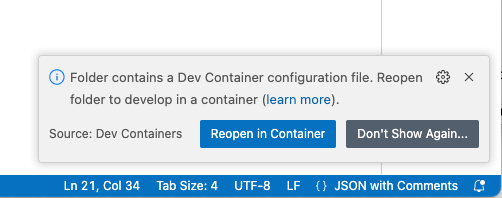
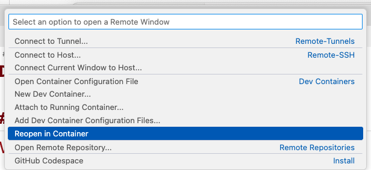

# Pre-Requisite
* Docker
* Docker Compose
* [Docker Desktop](https://www.docker.com/products/docker-desktop/)

# Обзор

В данном проекте есть два варианта запуска приложений
* Docker Compose
* Dev Container

Оба подхода используют один и тот же `docker-compose.yml` файл. Только в случае с Dev Container еще загружается и настраевается среда для разработки через VS Code с установленными `nx`, `npm`.

# Запуск через Dev Container

* Откройте VS Code
* Установите пакет с расширениями [Remote Development](https://marketplace.visualstudio.com/items?itemName=ms-vscode-remote.vscode-remote-extensionpack) от Microsoft
* Откройте папку с кодом. После VS Code предложит переоткрыть проект в Dev Container-е, как показано ниже. Согласитесь.

* Если предыдущий вариант не сработал, то можно самастоятельно переоткрыть проект в Dev Container-е, как показано ниже. Используйте ссылку в нижнем левом углу VS Code

* В открывшемся меню нажмите на "Reopen in container", как показано ниже

# Запуск через Docker Compose

1. Открыть в терминале папке с проекта
2. Перейти в папке `project`
3. Выполнить комманду `sudo docker compose --env-file "./.env-example" --file "./docker-compose.yml" up -d`
5. Займет какое-то время прежде чем он запустит все службы и БДых
